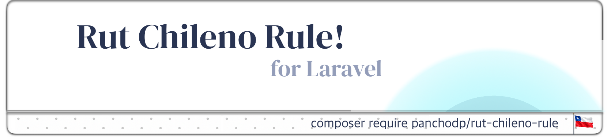

<p align="center"><a target="_blank"> </a></p>

<p align="center">
<a ></a>
<a ></a>
<a href="https://packagist.org/packages/panchodp/rut-chileno-rule"></a>
<a href="https://packagist.org/packages/panchodp/rut-chileno-rule"></a>

# Rut Chileno Rule for Laravel.

Regla de validación de RUT chileno para Laravel.

## Requisitos

- PHP 8.4+
- Laravel 10+

## Instalación

```bash
composer require panchodp/rut-chileno-rule
```

## Uso Regla de Validación

```php
// En tu FormRequest o Controller
$request->validate([
    'rut' => 'required|rutchileno',
]);

// O con el facade Validator
use Illuminate\Support\Facades\Validator;

$validator = Validator::make($data, [
    'rut' => 'required|rutchileno',
]);
```

## Regla de validación

| Regla | Descripción |
|-------|-------------|
| `rutchileno` | Valida que el campo sea un RUT chileno válido |

Acepta formatos: `12.345.678-5`, `12345678-5`, `123456785`

## Posibles Errores específicos

El validador retorna mensajes específicos según el tipo de error:

| Error | Descripción |
|-------|-------------|
| `not_string` | El valor no es texto |
| `min_length` | El RUT es demasiado corto |
| `max_length` | Excede el máximo de caracteres (9) |
| `invalid_characters` | Contiene caracteres no permitidos |
| `invalid_verifier` | El dígito verificador es incorrecto |

> **Nota:** Los valores `null` y vacíos pasan la validación. Usa la regla `required` para campos obligatorios.

## Personalizar mensajes de error

Publica los archivos de idioma:

```bash
php artisan vendor:publish --tag=rutchileno-lang
```

O define el mensaje en `resources/lang/es/validation.php`:

```php
'rutchileno' => 'El :attribute no es un RUT chileno válido.',
```

## Helpers de Formateo para trabajar con RUTs

Funciones globales para formatear y manipular RUTs:

```php
// Formatear
rut_format('123456785');       // "12.345.678-5"
rut_format_dash('123456785');  // "12345678-5"

// Limpiar
rut_clean('12.345.678-5');     // "123456785"

// Extraer partes
rut_get_number('12.345.678-5');   // "12345678"
rut_get_verifier('12.345.678-5'); // "5"

// Calcular dígito verificador
rut_calculate_verifier('12345678'); // "5"

// Validar
rut_validate('12.345.678-5');  // true
rut_validate('12.345.678-0');  // false
```

### Caso de uso típico

```php
// Guardar en BD sin formato
$user->rut = rut_clean($request->rut);  // "123456785"

// Mostrar formateado
echo rut_format($user->rut);  // "12.345.678-5"
```

## Facade Rut

También puedes usar la Facade `Rut`:

```php
use Panchodp\RutChileno\Facades\Rut;

Rut::format('123456785');         // "12.345.678-5"
Rut::clean('12.345.678-5');       // "123456785"
Rut::formatWithDash('123456785'); // "12345678-5"
Rut::isValid('12.345.678-5');     // true
```

## Testing

```bash
composer test

# Con coverage
composer test:coverage
```

## Licencia

[MIT](https://github.com/PanchoDP/rut-chileno-rule/blob/master/LICENSE.md)